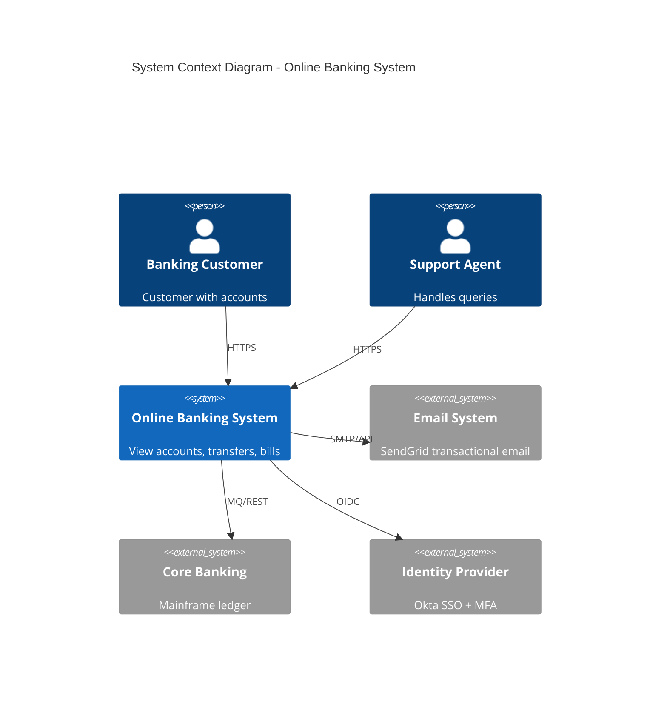
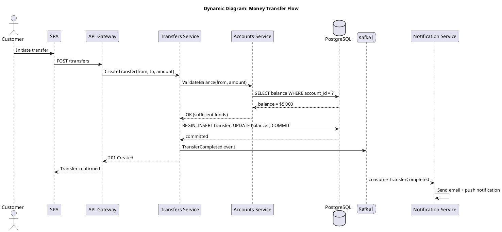
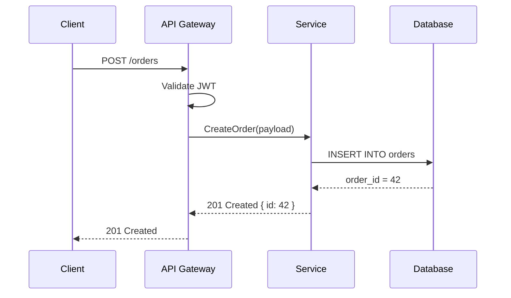
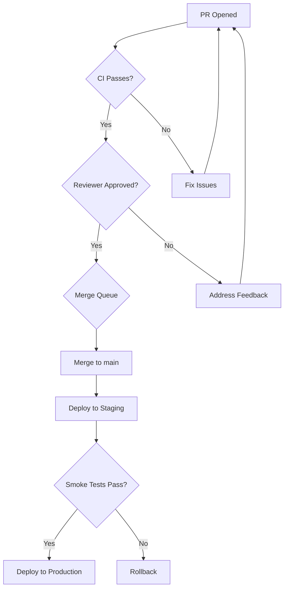
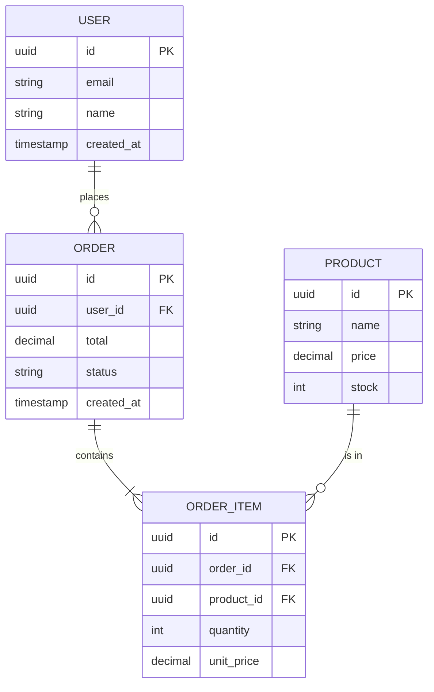
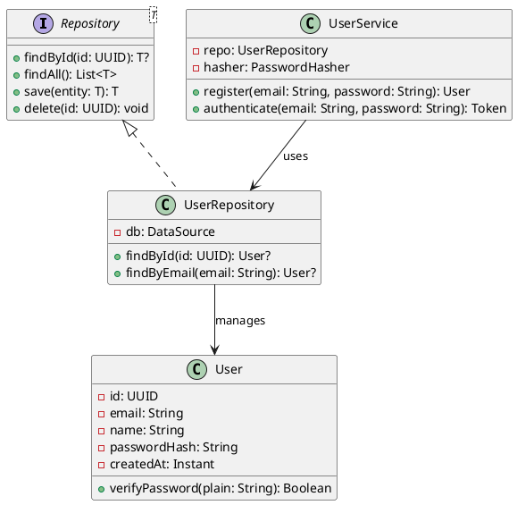
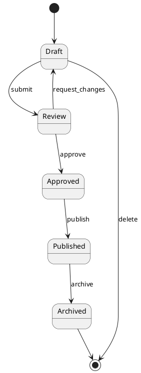

# Module 8.4: Documentation — Technical Writing, ADRs, C4 Model, Diagrams as Code

> **After completing this module you will be able to:**
>
> 1. Write Architecture Decision Records (ADRs) in Nygard and MADR formats, maintaining an immutable decision log with proper supersession chains.
> 2. Create multi-level C4 architecture diagrams (Context, Container, Component, Deployment) using Structurizr DSL, PlantUML, or Mermaid.
> 3. Apply the Diataxis framework to organize documentation into tutorials, how-to guides, reference, and explanation — without mixing modes.
> 4. Build a docs-as-code CI pipeline that enforces prose quality, link integrity, spelling, and diagram rendering on every pull request.
> 5. Specify REST, event-driven, GraphQL, and gRPC APIs using OpenAPI, AsyncAPI, SDL, and Protobuf — with CI-based linting and breaking-change detection.

> **Module 08.4** · **Last updated:** 2026-05-22

## Guiding ideas
1. **ADR (Architecture Decision Record): document decisions + rationale.**
2. **C4 Model: Context, Container, Component, Code.**
3. **Diagrams as code (PlantUML, Mermaid) > GUI (Visio).**
4. **README first; deeper docs on demand.**
5. **Docs-as-code: version, lint, review, deploy documentation like software.**

---

## 1. Documentation as a Product

Docs have users, jobs-to-be-done, and a maintenance cost. Treat them with the same
discipline as code: review, lint, version, deprecate. Untouched docs decay faster than
untested code.

### 1.1 Why documentation fails

| Failure mode | Symptom | Mitigation |
|---|---|---|
| No audience definition | Docs too shallow for experts, too dense for newcomers | Declare audience on every page |
| No ownership | Pages last edited in 2019 | Assign a DRI (Directly Responsible Individual) per docs section |
| No review process | Inaccurate content merged unreviewed | PRs for docs, same as code |
| No CI | Broken links, stale examples, lint violations | Automated checks on every push |
| No deprecation | 300-page wiki with 40% obsolete | TTL metadata; auto-archive after expiry |
| Wrong medium | Architecture diagrams in Slack threads | Single source of truth, docs-as-code |

### 1.2 Documentation ownership models

**Centralized technical writing team.** A dedicated team owns all docs. Works for
large orgs (Google, Stripe). Risk: bottleneck; writers don't have domain context.

**Distributed ownership.** Engineers write docs for their own systems. Works for
smaller teams. Risk: inconsistent quality, neglected updates.

**Hybrid (recommended).** Engineers write first drafts; tech writers review, edit,
and maintain style consistency. The team that owns the code owns the docs.

### 1.3 Docs as a deliverable

Definition of Done should include documentation:

```
Acceptance criteria for feature X:
- [ ] Unit tests pass (80%+ coverage)
- [ ] Integration tests pass
- [ ] API docs updated (OpenAPI spec)
- [ ] README updated if public-facing
- [ ] ADR written if architectural decision made
- [ ] Runbook updated if operational change
```

### 1.4 Measuring documentation quality

| Metric | How to measure | Target |
|---|---|---|
| Freshness | Last edit date vs. code last modified | Docs updated within 30 days of code change |
| Coverage | % of public APIs with docs | 100% for external, 80% for internal |
| Accuracy | User-reported doc bugs per quarter | Trending down |
| Findability | Search success rate (analytics) | >80% first-query success |
| Completeness | Diátaxis audit: all 4 modes present? | Yes for mature products |
| Link health | Broken link count | Zero in CI |

---

## 2. Diátaxis Framework (Daniele Procida)

Four documentation modes, each with a *different reader job*. Mixing them produces docs
that fail every reader.

| Mode | Reader is | Form | Failure if mixed |
|---|---|---|---|
| **Tutorial** | learning | guided lesson, hand-held | becomes a how-to and loses learners |
| **How-to guide** | working | task-focused recipe, assumes basics | becomes a tutorial and bores experts |
| **Reference** | looking up | exhaustive, dry, structured | becomes explanation and gets verbose |
| **Explanation** | understanding | discursive, why-focused | becomes reference and loses narrative |

### 2.1 Applying Diátaxis in practice

Apply: every page declares its mode in the URL or front matter
(`/tutorials/`, `/guides/`, `/reference/`, `/explanation/`).

**Tutorial example structure:**

```markdown
# Tutorial: Deploy Your First Lambda Function

> **Audience:** Beginners with AWS account access
> **Time:** 20 minutes
> **Prerequisites:** AWS CLI installed, Node.js 18+

## What you'll build
A simple HTTP endpoint that returns JSON.

## Step 1: Create the function
[hand-held, every keystroke shown, expected output shown]

## Step 2: Deploy
[...]

## Step 3: Test
[...]

## What you learned
[recap of concepts introduced]

## Next steps
[links to how-to guides for real use cases]
```

**How-to guide example structure:**

```markdown
# How to: Configure mTLS Between Services

> **Assumes:** You have a running Kubernetes cluster with cert-manager installed.

## Generate certificates
[commands, no background explanation]

## Configure the server
[exact config snippets]

## Configure the client
[exact config snippets]

## Verify
[test command with expected output]

## Troubleshooting
[common errors and fixes]
```

**Reference example structure:**

```markdown
# API Reference: /v2/users

## GET /v2/users

### Parameters
| Name | Type | Required | Description |
|------|------|----------|-------------|
| page | int  | no       | Page number (default: 1) |
| limit| int  | no       | Items per page (default: 20, max: 100) |

### Response 200
[schema]

### Response 401
[schema]

### Example
[curl command + response body]
```

**Explanation example structure:**

```markdown
# Why We Chose Event Sourcing

## The problem
[context, constraints, forces at play]

## Alternatives considered
[CRUD, CQRS without ES, etc.]

## How event sourcing solves it
[conceptual explanation, no code]

## Trade-offs
[what became harder]

## Further reading
[links to ADR, reference docs]
```

### 2.2 Common Diátaxis mistakes

| Mistake | Example | Fix |
|---|---|---|
| Tutorial disguised as reference | "Tutorial" that lists every CLI flag | Remove completeness; show one path |
| How-to that explains why | 3 paragraphs of context before the first command | Move explanation to a separate page, link it |
| Reference with opinions | "We recommend using..." in API docs | Move recommendations to how-to or explanation |
| Explanation without narrative | Bullet-point list of facts | Write prose with a logical flow |

### 2.3 Directory structure with Diátaxis

```
docs/
├── tutorials/
│   ├── getting-started.md
│   ├── first-deployment.md
│   └── custom-plugin.md
├── guides/
│   ├── configure-auth.md
│   ├── migrate-v2-to-v3.md
│   └── troubleshoot-networking.md
├── reference/
│   ├── api/
│   │   ├── users.md
│   │   ├── orders.md
│   │   └── webhooks.md
│   ├── cli.md
│   ├── config.md
│   └── errors.md
└── explanation/
    ├── architecture.md
    ├── security-model.md
    └── data-model.md
```

---

## 3. README Essentials

A README is the project's elevator pitch + 5-minute success path. Order matters:

1. **One-paragraph value prop** — what is this, who it's for, why care.
2. **Status badges** — build, version, license.
3. **Install** — minimal command, exact versions.
4. **Quickstart** — runnable example producing visible output in <60 seconds.
5. **Links** — full docs, contributing, license, issue tracker.

Anti-patterns: marketing-speak before quickstart, install instructions for 9 platforms
before "what does it do."

### 3.1 README template

```markdown
# Project Name

One-paragraph description of what this does and why it exists.

[](...)
[](...)
[](...)

## Install

```bash
npm install project-name
```

## Quickstart

```typescript
import { Client } from 'project-name';

const client = new Client({ apiKey: process.env.API_KEY });
const result = await client.query('hello');
console.log(result);
// => { status: 'ok', data: 'Hello, world!' }
```

## Documentation

- [Getting Started Tutorial](docs/tutorials/getting-started.md)
- [API Reference](docs/reference/api/)
- [Architecture](docs/explanation/architecture.md)

## Contributing

See [CONTRIBUTING.md](CONTRIBUTING.md).

## License

[MIT](LICENSE)
```

### 3.2 README anti-patterns

| Anti-pattern | Why it's bad | Fix |
|---|---|---|
| Logo + tagline + no install | Reader can't use it | Install + quickstart first |
| "Table of Contents" 40 lines deep | Indicates README is too long | Move content to docs/, keep README lean |
| Install for 8 platforms sequentially | Buries the common path | Tab groups or separate pages |
| No runnable example | Reader leaves | Show working code with expected output |
| Badges wall (15+ badges) | Visual noise, nobody reads them | 3-4 meaningful badges max |
| "TODO" sections committed | Signals abandonware | Remove or complete before publishing |

---

## 4. Inline Code Documentation

### 4.1 When to write

- The **why**, not the what (the code is the what).
- Hidden invariants the type system can't express.
- Performance-critical assumptions (`O(1) amortized; resize doubles capacity`).
- References to external specs (`per RFC 6749 §4.1.3`).
- Workarounds (`bug in lib X v2.4, remove when upgraded`).
- Non-obvious side effects (`acquires lock on table X`).
- Thread-safety guarantees or lack thereof.

### 4.2 When not to write

- Restating the code (`// increment counter` above `counter++`).
- Documenting names that should just be better.
- Stale comments — worse than no comment.
- Comments that disable linter warnings without justification.

### 4.3 Doc-comment conventions by language

| Language | Tool | Format | Doctests? |
|---|---|---|---|
| Rust | rustdoc | `///` with Markdown | Yes, `///` examples compiled and run |
| Python | Sphinx/autodoc | Google or NumPy docstring style | Yes, `doctest` module |
| Go | godoc | Comment directly above declaration | Yes, `Example` functions |
| TypeScript/JS | TSDoc/JSDoc | `/** */` with `@param`, `@returns` | No native; use test examples |
| Java | Javadoc | `/** */` with `@param`, `@return`, `@throws` | No native |
| Kotlin | KDoc | `/** */` with `@param`, `@return` | No native |
| C# | DocFX | `///` XML comments | No native |
| Swift | DocC | `///` with Markdown | No native |

### 4.4 Doc-comment best practices

```python
def calculate_retry_delay(attempt: int, base_ms: int = 100, max_ms: int = 30_000) -> int:
    """Calculate exponential backoff delay with jitter.

    Uses decorrelated jitter (per AWS Architecture Blog) to spread
    retry storms across a wider time window than simple exponential.

    Args:
        attempt: Zero-indexed retry attempt number.
        base_ms: Minimum delay in milliseconds.
        max_ms: Maximum delay cap in milliseconds.

    Returns:
        Delay in milliseconds, guaranteed in [base_ms, max_ms].

    Raises:
        ValueError: If attempt < 0 or base_ms > max_ms.

    Example:
        >>> calculate_retry_delay(0, base_ms=100)  # first retry
        100  # minimum
        >>> calculate_retry_delay(5, base_ms=100, max_ms=30000)
        # some value in [100, 30000]
    """
```

```rust
/// Compresses the input buffer using LZ4 frame format.
///
/// # Performance
/// Processes ~2 GB/s on modern x86-64 (single-threaded).
/// Output is typically 40-60% of input for JSON payloads.
///
/// # Errors
/// Returns [`CompressionError::InputTooLarge`] if `input.len() > MAX_INPUT_SIZE`.
///
/// # Examples
/// ```
/// let compressed = compress(b"hello world")?;
/// assert!(compressed.len() < 11);
/// ```
pub fn compress(input: &[u8]) -> Result<Vec<u8>, CompressionError> {
```

---

## 5. Architecture Decision Records (ADRs)

Lightweight record of a significant decision and its context. Originated by
Michael Nygard, 2011.

### 5.1 Nygard format (original)

```markdown
# ADR-0001: Use PostgreSQL as Primary Database

## Status
Accepted

## Context
We need a relational database for our SaaS application. The data model has
complex relationships between tenants, users, and resources. We need ACID
transactions for financial operations. The team has deep PostgreSQL experience.

## Decision
We will use PostgreSQL 16 as our primary database, deployed on AWS RDS with
Multi-AZ configuration.

## Consequences
- Easier: Complex queries, full-text search, JSON operations without a
  separate document store.
- Harder: Horizontal sharding if we outgrow a single instance; will need
  Citus or manual sharding later.
- Constrained: Must design schema carefully now as migration cost grows
  with data volume.
```

Minimal, sufficient for most decisions. Five sections, each 2-5 sentences.

### 5.2 MADR (Markdown ADR) format

Richer template: includes considered options, decision drivers, pros/cons per
option, and links. Better for decisions with several viable paths.

```markdown
# ADR-0005: Choose Message Broker for Event-Driven Architecture

## Status
Accepted (2026-03-15)

## Decision Drivers
- Must support at least 50,000 messages/second sustained
- Must have dead-letter queue support
- Team has Kafka experience but limited RabbitMQ experience
- Must support schema evolution (Avro/Protobuf)
- Budget constraint: < $2,000/month managed service

## Considered Options
1. Apache Kafka (self-managed on EKS)
2. Amazon MSK (managed Kafka)
3. Amazon SQS + SNS
4. RabbitMQ (self-managed)
5. NATS JetStream

## Decision Outcome
Chosen option: **Amazon MSK** (option 2).

### Positive Consequences
- Managed service reduces operational burden
- Team's Kafka experience transfers directly
- Schema Registry available via Glue Schema Registry
- Meets throughput requirements with margin

### Negative Consequences
- Higher cost than self-managed (~$1,800/month for 3-broker cluster)
- Vendor lock-in to AWS for the broker layer
- MSK Connect limited compared to standalone Kafka Connect

## Pros and Cons of Other Options

### Apache Kafka (self-managed)
- (+) Full control, lower cloud cost
- (-) Operational burden: upgrades, monitoring, ZooKeeper/KRaft migration
- (-) Need dedicated SRE capacity we don't have

### Amazon SQS + SNS
- (+) Fully serverless, zero ops
- (-) No log compaction, no replay
- (-) 256 KB message size limit
- (-) No ordering guarantees without FIFO (which has 3,000 msg/s limit)

### RabbitMQ
- (+) Rich routing, low latency
- (-) No team experience
- (-) Throughput ceiling lower than Kafka
- (-) Clustering is fragile at scale

### NATS JetStream
- (+) Lightweight, fast, simple
- (-) Immature ecosystem for schema registry
- (-) Smaller community, fewer integrations
- (-) No team experience

## Links
- [RFC-012: Event-Driven Architecture](../rfcs/RFC-012.md)
- [ADR-0003: Choose Cloud Provider](0003-cloud-provider.md)
```

### 5.3 When to write an ADR

- Choosing a database, framework, language, or cloud service.
- Defining a versioning policy, API strategy, or data model.
- Adopting an authentication scheme or encryption approach.
- Selecting a deployment strategy (Kubernetes vs. serverless, etc.).
- Making a build-vs-buy decision.
- Deciding on a testing strategy or CI/CD architecture.
- Any decision that future-you will ask "why the hell did we do *that*?"

**When NOT to write an ADR:**

- Trivial decisions (which linter config option).
- Decisions that can be easily reversed in a day.
- Pure implementation details with no architectural impact.

### 5.4 ADR lifecycle and immutability

ADRs are **immutable** once Accepted. To change a decision, write a new ADR with
status `Supersedes ADR-N` and update ADR-N to `Superseded by ADR-M`. The history
is the value.

```
Status transitions:
  Proposed → Accepted
  Proposed → Rejected
  Accepted → Deprecated
  Accepted → Superseded by ADR-M
```

Store in the repo (`docs/adr/NNNN-title.md`). Decisions belong with the code
they constrain.

### 5.5 ADR numbering and organization

```
docs/
└── adr/
    ├── 0001-use-postgresql.md
    ├── 0002-adopt-kubernetes.md
    ├── 0003-choose-cloud-provider.md
    ├── 0004-api-versioning-strategy.md
    ├── 0005-message-broker.md
    ├── 0006-auth-with-oidc.md
    └── index.md          # auto-generated table of all ADRs
```

### 5.6 Tooling: adr-tools

**adr-tools** (npryce/adr-tools) is a bash CLI that scaffolds ADR management:

```bash
# Install
brew install adr-tools          # macOS
# or clone: https://github.com/npryce/adr-tools

# Initialize ADR directory
adr init docs/adr

# Create new ADR
adr new "Use PostgreSQL as Primary Database"
# Creates: docs/adr/0001-use-postgresql-as-primary-database.md

# Create ADR that supersedes another
adr new -s 3 "Migrate from AWS to GCP"
# Creates new ADR, updates ADR-0003 status to "Superseded by ADR-N"

# Generate table of contents
adr list

# Generate a graph of ADR relationships
adr generate graph | dot -Tpng -o adr-graph.png
```

### 5.7 Tooling: log4brains

**log4brains** (thomvaill/log4brains) is a more modern ADR management tool with
a web UI:

```bash
# Install
npm install -g log4brains

# Initialize
log4brains init

# Create new ADR (interactive)
log4brains adr new

# Preview ADRs in browser
log4brains preview
# Opens http://localhost:4004 with searchable ADR list

# Build static site for deployment
log4brains build
# Output in .log4brains/out/ — deploy to GitHub Pages, Netlify, etc.
```

log4brains advantages over adr-tools:
- Web UI with search and filtering.
- Support for MADR template out of the box.
- Static site generation for team-wide access.
- Git integration showing ADR change history.
- Package-level ADRs for monorepos.

### 5.8 ADR anti-patterns

| Anti-pattern | Why it's bad | Fix |
|---|---|---|
| ADR written after the fact | Lost context, rationalized decisions | Write during or immediately after the decision |
| No considered alternatives | Looks like a rubber stamp | Always list at least 2 alternatives, even if obvious |
| ADR for every tiny choice | Noise drowns signal | Only for decisions with lasting impact |
| ADRs in Confluence, not repo | Drift from code reality | Store in the repo next to the code |
| No status tracking | Unknown if still valid | Review quarterly; mark deprecated/superseded |
| Editing accepted ADRs | Destroys historical record | Write a new ADR that supersedes |

### 5.9 RFC (Request for Comments) process

For larger decisions that need cross-team input, an RFC process adds structured
feedback before committing to an ADR.

**RFC lifecycle:**

```
Draft → Review (2 weeks) → Accepted/Rejected → ADR created (if accepted)
```

**RFC template:**

```markdown
# RFC-012: Adopt Event-Driven Architecture

## Authors
Jane Smith, Platform Team

## Status
Review (closes 2026-04-01)

## Summary
Proposal to adopt event-driven architecture using Kafka for asynchronous
communication between services, replacing synchronous REST calls for
non-critical-path operations.

## Motivation
- Current synchronous architecture creates cascading failures
- P99 latency exceeds SLO during peak traffic
- Tight coupling prevents independent service deployment

## Detailed Design
[Technical details, data flow diagrams, schema definitions]

## Alternatives Considered
[Other approaches evaluated and why they were rejected]

## Migration Plan
[Phased rollout, backward compatibility, rollback strategy]

## Security Considerations
[Threat model, auth for events, data classification]

## Open Questions
- Should we use Avro or Protobuf for event schemas?
- What's the retention policy for event logs?

## Decision
[Filled in after review period closes]
```

**RFC vs. ADR:**

| Aspect | RFC | ADR |
|---|---|---|
| Scope | Large, cross-team | Any significant decision |
| Process | Formal review period | Can be synchronous/async |
| Length | 5-20 pages | 1-2 pages |
| Outcome | Feeds into one or more ADRs | Self-contained record |
| Audience | Broad (org-wide) | Team-level |

### 5.10 Design docs (Google-style)

Google's design doc format is another structured approach for significant technical
decisions. Lighter than a full RFC, heavier than an ADR.

```markdown
# Design Doc: User Notification Service

## Metadata
- Author: @engineer
- Reviewers: @tech-lead, @security-lead, @sre-lead
- Status: Approved
- Last updated: 2026-03-15

## Context and Scope
[What problem, who's affected, what's in/out of scope]

## Goals and Non-Goals
Goals:
- Deliver notifications within 5 seconds of trigger event
- Support email, SMS, push, and in-app channels
- Handle 10,000 notifications/minute at peak

Non-goals:
- Marketing campaign management (separate system)
- Rich content templating (use existing CMS)

## The Design
[Architecture, data model, API surface, sequence diagrams]

## Alternatives Considered
[Why the proposed design is better than alternatives]

## Cross-Cutting Concerns
### Security
[auth, encryption, PII handling]

### Privacy
[data retention, GDPR compliance]

### Observability
[metrics, logs, traces, alerts]

## Milestones
| Milestone | Date | Deliverable |
|-----------|------|-------------|
| M1 | 2026-04-01 | Email channel MVP |
| M2 | 2026-05-01 | Push + in-app |
| M3 | 2026-06-01 | SMS + rate limiting |
```

---

## 6. C4 Model (Simon Brown)

Hierarchical view of software architecture. Four levels of zoom; rarely need all four.

| Level | Audience | Shows |
|---|---|---|
| **1. Context** | everyone, including non-technical | system as a black box + users + external systems |
| **2. Container** | technical, all teams | deployable units (web app, API, DB, queue) and their interactions |
| **3. Component** | development team | inside one container — major code components and responsibilities |
| **4. Code** | only when useful | classes/functions inside one component (UML-ish) |

Most teams stop at Container or Component. Level 4 is usually noise — generate it
from code if needed.

Each diagram has a **legend** and **explicit notation** — no "every team draws
differently."

### 6.1 C4 diagram elements

Every C4 diagram uses these building blocks:

| Element | Description | Notation |
|---|---|---|
| Person | A user of the system (human) | Stick figure or labeled box |
| Software System | Top-level system boundary | Large box with label + description |
| Container | Deployable unit (process, app, DB) | Box within system boundary |
| Component | Logical grouping within a container | Box within container boundary |
| Relationship | Communication between elements | Arrow with label (protocol, data) |

### 6.2 Level 1: System Context diagram

Shows the system as a single box, surrounded by its users and external systems.
Non-technical stakeholders can understand this.

**PlantUML example (with C4-PlantUML library):**

```plantuml
@startuml
!include https://raw.githubusercontent.com/plantuml-stdlib/C4-PlantUML/master/C4_Context.puml

title System Context Diagram - Online Banking System

Person(customer, "Banking Customer", "A customer of the bank with one or more accounts")
Person(support, "Support Agent", "Handles customer queries via internal tools")

System(banking, "Online Banking System", "Allows customers to view accounts, make transfers, pay bills")

System_Ext(email, "Email System", "SendGrid-based transactional email")
System_Ext(core, "Core Banking System", "Mainframe-based ledger, accounts, transactions")
System_Ext(id_provider, "Identity Provider", "Okta-based SSO and MFA")

Rel(customer, banking, "Views accounts, transfers money", "HTTPS")
Rel(support, banking, "Manages customer accounts", "HTTPS")
Rel(banking, email, "Sends notifications", "SMTP/API")
Rel(banking, core, "Reads/writes transactions", "MQ/REST")
Rel(banking, id_provider, "Authenticates users", "OIDC")

@enduml
```

**Mermaid equivalent:**



### 6.3 Level 2: Container diagram

Zooms into the system boundary. Shows individual deployable units and how they
communicate.

```plantuml
@startuml
!include https://raw.githubusercontent.com/plantuml-stdlib/C4-PlantUML/master/C4_Container.puml

title Container Diagram - Online Banking System

Person(customer, "Banking Customer")

System_Boundary(banking, "Online Banking System") {
    Container(spa, "Single-Page App", "React, TypeScript", "Provides banking UI")
    Container(api, "API Gateway", "Kong", "Routes and rate-limits API calls")
    Container(accounts_svc, "Accounts Service", "Go", "Account management, balances")
    Container(transfers_svc, "Transfers Service", "Go", "Payment processing, validation")
    Container(notifications_svc, "Notification Service", "Python", "Email, SMS, push")
    ContainerDb(db, "PostgreSQL", "Accounts, transactions, audit log")
    ContainerQueue(queue, "Kafka", "Event bus for async operations")
    Container(cache, "Redis", "Session store, rate limiting")
}

System_Ext(core, "Core Banking System", "Mainframe")
System_Ext(email, "Email System", "SendGrid")

Rel(customer, spa, "Uses", "HTTPS")
Rel(spa, api, "API calls", "HTTPS/JSON")
Rel(api, accounts_svc, "Routes", "gRPC")
Rel(api, transfers_svc, "Routes", "gRPC")
Rel(accounts_svc, db, "Reads/writes", "SQL")
Rel(transfers_svc, db, "Reads/writes", "SQL")
Rel(transfers_svc, queue, "Publishes events", "Kafka protocol")
Rel(queue, notifications_svc, "Consumes events", "Kafka protocol")
Rel(notifications_svc, email, "Sends", "API")
Rel(accounts_svc, core, "Syncs", "MQ")
Rel(api, cache, "Sessions, rate limits", "Redis protocol")

@enduml
```

### 6.4 Level 3: Component diagram

Zooms into one container. Shows the major structural building blocks and their
interactions.

```plantuml
@startuml
!include https://raw.githubusercontent.com/plantuml-stdlib/C4-PlantUML/master/C4_Component.puml

title Component Diagram - Accounts Service

Container_Boundary(accounts_svc, "Accounts Service") {
    Component(controller, "Account Controller", "Go, net/http", "Handles HTTP/gRPC requests")
    Component(service, "Account Service", "Go", "Business logic, validation")
    Component(repo, "Account Repository", "Go, sqlx", "Data access layer")
    Component(cache_client, "Cache Client", "Go, go-redis", "Caching layer")
    Component(event_pub, "Event Publisher", "Go, sarama", "Publishes domain events")
    Component(auth_mw, "Auth Middleware", "Go", "JWT validation, RBAC")
    Component(audit, "Audit Logger", "Go", "Records all state changes")
}

ContainerDb(db, "PostgreSQL")
Container(cache, "Redis")
ContainerQueue(queue, "Kafka")

Rel(controller, auth_mw, "Validates request")
Rel(controller, service, "Delegates to")
Rel(service, repo, "Reads/writes")
Rel(service, cache_client, "Cache lookups")
Rel(service, event_pub, "Publishes events")
Rel(service, audit, "Logs changes")
Rel(repo, db, "SQL queries")
Rel(cache_client, cache, "GET/SET")
Rel(event_pub, queue, "Produce")

@enduml
```

### 6.5 Level 4: Code diagram

Rarely drawn manually. When needed, generate from code using:

- IDE class diagram export
- UML generators (`tsuml2` for TypeScript, `pyreverse` for Python, `goplantuml` for Go)
- Architecture fitness functions that assert structure

### 6.6 Supplementary C4 diagrams

Beyond the 4 core levels, C4 defines supplementary diagrams:

**Deployment diagram:** Maps containers to infrastructure.

```plantuml
@startuml
!include https://raw.githubusercontent.com/plantuml-stdlib/C4-PlantUML/master/C4_Deployment.puml

title Deployment Diagram - Production

Deployment_Node(aws, "AWS", "us-east-1") {
    Deployment_Node(eks, "EKS Cluster", "Kubernetes 1.29") {
        Deployment_Node(ns_app, "Namespace: banking") {
            Container(api_pod, "API Gateway", "Kong, 3 replicas")
            Container(acc_pod, "Accounts Service", "Go, 5 replicas")
            Container(txn_pod, "Transfers Service", "Go, 3 replicas")
        }
    }
    Deployment_Node(rds, "RDS") {
        ContainerDb(db, "PostgreSQL 16", "Multi-AZ, db.r6g.xlarge")
    }
    Deployment_Node(msk, "MSK") {
        ContainerQueue(kafka, "Kafka 3.7", "3-broker cluster")
    }
    Deployment_Node(elasticache, "ElastiCache") {
        Container(redis, "Redis 7", "Cluster mode, 3 shards")
    }
}

Deployment_Node(cloudflare, "Cloudflare") {
    Container(cdn, "CDN + WAF", "Edge caching, DDoS protection")
}

Rel(cdn, api_pod, "Proxies", "HTTPS")
Rel(acc_pod, db, "SQL", "TLS")
Rel(txn_pod, kafka, "Produce/Consume", "TLS")
Rel(api_pod, redis, "Cache", "TLS")

@enduml
```

**Dynamic diagram:** Shows runtime interactions for a specific scenario (sequence
diagram style).



**System landscape diagram:** Multi-system view for enterprise architecture.

### 6.7 Structurizr DSL

The official C4 tooling. Single DSL source generates all diagram levels.

```
workspace {
    model {
        customer = person "Banking Customer" "Has accounts"
        support = person "Support Agent"

        banking = softwareSystem "Online Banking" "View accounts, transfer money" {
            spa = container "SPA" "React, TypeScript" "Web browser"
            api = container "API Gateway" "Kong" "Routes requests"
            accountsSvc = container "Accounts Service" "Go" "Account mgmt"
            transfersSvc = container "Transfers Service" "Go" "Payments"
            db = container "PostgreSQL" "Relational" "Database" "Database"
            kafka = container "Kafka" "Event bus" "Queue"
        }

        email = softwareSystem "Email System" "SendGrid" "External"
        core = softwareSystem "Core Banking" "Mainframe" "External"

        customer -> spa "Uses" "HTTPS"
        spa -> api "API calls" "HTTPS/JSON"
        api -> accountsSvc "Routes" "gRPC"
        api -> transfersSvc "Routes" "gRPC"
        accountsSvc -> db "Reads/writes" "SQL"
        transfersSvc -> db "Reads/writes" "SQL"
        transfersSvc -> kafka "Publishes" "Kafka protocol"
        accountsSvc -> core "Syncs" "MQ"
    }

    views {
        systemContext banking "Context" {
            include *
            autoLayout
        }

        container banking "Containers" {
            include *
            autoLayout
        }

        theme default
    }
}
```

Run with `structurizr-cli` or use the Structurizr web UI / Lite (self-hosted).

### 6.8 C4 model anti-patterns

| Anti-pattern | Why it hurts | Fix |
|---|---|---|
| Missing legends | Readers guess what boxes mean | Always add key/legend |
| Too much detail at Context level | Loses non-technical audience | Only system + users + externals |
| Every microservice at Component level | Unreadable | One component diagram per container |
| Diagrams not versioned | Drift from reality | Store as code, render in CI |
| No explicit relationships | Arrows without labels | Label every arrow with protocol + data |
| Level 4 drawn manually | Instant staleness | Auto-generate or skip |
| Mixing levels in one diagram | Inconsistent abstraction | One level per diagram |

---

## 7. Diagrams as Code

Diagrams in Confluence/Lucidchart drift from reality immediately. Text-based
diagrams version with the code.

| Tool | Strengths | Weaknesses |
|---|---|---|
| **PlantUML** | Mature, every UML diagram type, sequence diagrams excellent | Syntax verbose, layout can be ugly |
| **Mermaid** | Renders natively in GitHub/GitLab Markdown, lowest friction | Limited diagram types, less control over layout |
| **Structurizr DSL** | C4-native, single source for multiple views | C4-only, learning curve |
| **D2** (Terrastruct) | Modern syntax, good auto-layout, code-like syntax | Younger ecosystem |
| **Excalidraw** (with `.excalidraw` files) | Hand-drawn aesthetic, version-control-friendly | Not text-based, binary-ish JSON |
| **draw.io / diagrams.net** | Non-code fallback; free | XML files diff poorly |

### 7.1 CI integration for diagrams

Render in CI; embed as SVG in docs. Broken diagram = broken build.

```yaml
# GitHub Actions: render PlantUML diagrams
name: Render Diagrams
on:
  push:
    paths: ['docs/**/*.puml']

jobs:
  render:
    runs-on: ubuntu-latest
    steps:
      - uses: actions/checkout@v4
      - name: Render PlantUML
        uses: cloudbees/plantuml-github-action@v1
        with:
          args: -tsvg docs/diagrams/*.puml
      - name: Commit rendered SVGs
        run: |
          git config user.name "CI Bot"
          git config user.email "ci@example.com"
          git add docs/diagrams/*.svg
          git diff --staged --quiet || git commit -m "chore: render diagrams"
          git push
```

```yaml
# Mermaid rendering via mermaid-cli
- name: Render Mermaid
  run: |
    npx @mermaid-js/mermaid-cli -i docs/diagrams/architecture.mmd -o docs/diagrams/architecture.svg
```

### 7.2 Mermaid quick reference

Sequence diagram:



Flowchart:



Entity-relationship diagram:



### 7.3 PlantUML quick reference

Class diagram with relationships:



State diagram:



### 7.4 D2 example

```d2
direction: right

customer: Banking Customer {
  shape: person
}

system: Online Banking {
  spa: React SPA
  api: API Gateway {
    shape: hexagon
  }
  services: Backend {
    accounts: Accounts Service
    transfers: Transfers Service
  }
  db: PostgreSQL {
    shape: cylinder
  }
}

customer -> system.spa: HTTPS
system.spa -> system.api: REST/JSON
system.api -> system.services.accounts: gRPC
system.api -> system.services.transfers: gRPC
system.services.accounts -> system.db: SQL
system.services.transfers -> system.db: SQL
```

---

## 8. API Documentation

### 8.1 OpenAPI (formerly Swagger)

REST contract spec. Machine-readable, generates client SDKs and server stubs.

```yaml
openapi: 3.1.0
info:
  title: User Management API
  version: 2.1.0
  description: |
    Manages user accounts, authentication, and profiles.
    
    ## Authentication
    All endpoints require a Bearer token obtained from POST /auth/token.
    
    ## Rate Limiting
    - Authenticated: 1000 req/min
    - Unauthenticated: 60 req/min
    
    ## Pagination
    List endpoints support cursor-based pagination via `cursor` and `limit` params.

servers:
  - url: https://api.example.com/v2
    description: Production
  - url: https://api.staging.example.com/v2
    description: Staging

paths:
  /users:
    get:
      operationId: listUsers
      summary: List users
      description: Returns a paginated list of users.
      tags: [Users]
      parameters:
        - name: cursor
          in: query
          schema:
            type: string
          description: Pagination cursor from previous response
        - name: limit
          in: query
          schema:
            type: integer
            minimum: 1
            maximum: 100
            default: 20
      responses:
        '200':
          description: Paginated user list
          content:
            application/json:
              schema:
                type: object
                properties:
                  data:
                    type: array
                    items:
                      $ref: '#/components/schemas/User'
                  next_cursor:
                    type: string
                    nullable: true
              example:
                data:
                  - id: "550e8400-e29b-41d4-a716-446655440000"
                    email: "jane@example.com"
                    name: "Jane Smith"
                    created_at: "2026-01-15T09:30:00Z"
                next_cursor: "eyJpZCI6MTAwfQ=="
        '401':
          $ref: '#/components/responses/Unauthorized'

  /users/{id}:
    get:
      operationId: getUser
      summary: Get user by ID
      tags: [Users]
      parameters:
        - name: id
          in: path
          required: true
          schema:
            type: string
            format: uuid
      responses:
        '200':
          description: User found
          content:
            application/json:
              schema:
                $ref: '#/components/schemas/User'
        '404':
          $ref: '#/components/responses/NotFound'

components:
  schemas:
    User:
      type: object
      required: [id, email, name, created_at]
      properties:
        id:
          type: string
          format: uuid
        email:
          type: string
          format: email
        name:
          type: string
          minLength: 1
          maxLength: 255
        created_at:
          type: string
          format: date-time

  responses:
    Unauthorized:
      description: Missing or invalid authentication
      content:
        application/json:
          schema:
            $ref: '#/components/schemas/Error'
    NotFound:
      description: Resource not found
      content:
        application/json:
          schema:
            $ref: '#/components/schemas/Error'

  securitySchemes:
    bearerAuth:
      type: http
      scheme: bearer
      bearerFormat: JWT

security:
  - bearerAuth: []
```

### 8.2 OpenAPI renderers

| Renderer | Strengths | Best for |
|---|---|---|
| **Swagger UI** | Interactive "try it out", familiar | Internal API portals |
| **Redoc** | Clean three-panel layout, better readability | External developer docs |
| **Stoplight** | Full platform (design, mock, docs) | API-first organizations |
| **Scalar** | Modern design, dark mode, performant | Developer portals |
| **RapiDoc** | Customizable, web component | Embedded in existing sites |

### 8.3 OpenAPI validation in CI

```yaml
# GitHub Actions
- name: Lint OpenAPI spec
  run: |
    npx @redocly/cli lint openapi.yaml --extends=recommended

- name: Check breaking changes
  run: |
    npx oasdiff breaking openapi.yaml openapi-main.yaml --fail-on ERR
```

### 8.4 AsyncAPI for event-driven APIs

OpenAPI's analog for event-driven APIs (Kafka, AMQP, MQTT, WebSocket).

```yaml
asyncapi: 3.0.0
info:
  title: Order Events
  version: 1.0.0
  description: Events published by the Order Service

channels:
  orderCreated:
    address: orders.created
    messages:
      OrderCreated:
        payload:
          type: object
          properties:
            order_id:
              type: string
              format: uuid
            customer_id:
              type: string
              format: uuid
            items:
              type: array
              items:
                $ref: '#/components/schemas/OrderItem'
            total:
              type: number
              format: decimal
            created_at:
              type: string
              format: date-time

  orderCancelled:
    address: orders.cancelled
    messages:
      OrderCancelled:
        payload:
          type: object
          properties:
            order_id:
              type: string
              format: uuid
            reason:
              type: string
            cancelled_at:
              type: string
              format: date-time

operations:
  publishOrderCreated:
    action: send
    channel:
      $ref: '#/channels/orderCreated'
  publishOrderCancelled:
    action: send
    channel:
      $ref: '#/channels/orderCancelled'
```

### 8.5 GraphQL schema as documentation

```graphql
"""
A user account in the system.
"""
type User {
  """Unique identifier (UUID v4)."""
  id: ID!

  """Email address. Unique across the system."""
  email: String!

  """Display name. 1-255 characters."""
  name: String!

  """When the account was created."""
  createdAt: DateTime!

  """Orders placed by this user. Paginated."""
  orders(first: Int = 10, after: String): OrderConnection!
}

type Query {
  """
  Fetch a user by ID.
  Returns null if the user does not exist.
  Requires: authenticated user or admin role.
  """
  user(id: ID!): User

  """
  Search users by name or email.
  Requires: admin role.
  Rate limited: 100 req/min.
  """
  searchUsers(query: String!, first: Int = 20, after: String): UserConnection!
}
```

Tools: **GraphiQL**, **Apollo Studio**, **Hoppscotch**, **Insomnia**.

### 8.6 gRPC documentation

`.proto` is the contract; `protoc-gen-doc` produces docs.

```protobuf
syntax = "proto3";

package banking.v1;

// AccountService manages bank accounts.
//
// All RPCs require a valid Bearer token in the `authorization` metadata key.
// Rate limited to 500 req/min per client.
service AccountService {
  // GetAccount returns account details by ID.
  // Returns NOT_FOUND if the account does not exist.
  // Returns PERMISSION_DENIED if the caller is not the account owner or admin.
  rpc GetAccount(GetAccountRequest) returns (Account);

  // ListTransactions returns paginated transactions for an account.
  // Results are ordered by created_at DESC.
  rpc ListTransactions(ListTransactionsRequest) returns (ListTransactionsResponse);
}

message GetAccountRequest {
  string account_id = 1; // UUID format
}

message Account {
  string id = 1;
  string owner_id = 2;
  string currency = 3; // ISO 4217 (e.g., "USD", "EUR")
  int64 balance_cents = 4; // Balance in smallest currency unit
  google.protobuf.Timestamp created_at = 5;
}
```

### 8.7 API documentation tools matrix

| Concern | REST | Events | GraphQL | gRPC |
|---|---|---|---|---|
| Spec format | OpenAPI 3.x | AsyncAPI 3.x | SDL (`.graphql`) | Protobuf (`.proto`) |
| Renderer | Redoc, Swagger UI | AsyncAPI Studio | GraphiQL, Apollo | protoc-gen-doc |
| SDK gen | openapi-generator | asyncapi/generator | graphql-codegen | protoc |
| Mock | Prism (Stoplight) | AsyncAPI mock | GraphQL Faker | grpc-mock |
| Lint | Redocly CLI | asyncapi validate | graphql-eslint | buf lint |
| Breaking change | oasdiff | manual diff | graphql-inspector | buf breaking |

### 8.8 API collections in repos

**Postman / Bruno / Insomnia** — collections double as executable examples; check
the collection into the repo.

```
api/
├── openapi.yaml
├── collections/
│   ├── bruno/
│   │   ├── users/
│   │   │   ├── list-users.bru
│   │   │   ├── get-user.bru
│   │   │   └── create-user.bru
│   │   └── auth/
│   │       └── get-token.bru
│   └── environments/
│       ├── local.bru
│       ├── staging.bru
│       └── production.bru
└── README.md
```

Bruno is preferred over Postman for docs-as-code because its `.bru` files are
plain-text, diffable, and don't require a cloud account.

---

## 9. Living Documentation

Specs that *are* tests, so they can't go stale.

### 9.1 BDD with Cucumber/SpecFlow/Behave

Gherkin scenarios serve as both acceptance tests and product spec.

```gherkin
Feature: Money Transfer
  As a banking customer
  I want to transfer money between my accounts
  So that I can manage my finances

  Background:
    Given I am logged in as "jane@example.com"
    And I have an account "Checking" with balance $5,000.00
    And I have an account "Savings" with balance $10,000.00

  Scenario: Successful transfer between own accounts
    When I transfer $1,000.00 from "Checking" to "Savings"
    Then the transfer should be completed
    And "Checking" balance should be $4,000.00
    And "Savings" balance should be $11,000.00
    And I should receive a confirmation notification

  Scenario: Transfer exceeding available balance
    When I transfer $6,000.00 from "Checking" to "Savings"
    Then the transfer should be rejected
    And I should see error "Insufficient funds"
    And "Checking" balance should be $5,000.00

  Scenario Outline: Transfer with invalid amount
    When I transfer <amount> from "Checking" to "Savings"
    Then the transfer should be rejected
    And I should see error "<error>"

    Examples:
      | amount  | error                          |
      | $0.00   | Amount must be greater than 0  |
      | -$50.00 | Amount must be greater than 0  |
      | $0.001  | Maximum 2 decimal places       |
```

### 9.2 Doctests

Runnable examples in docstrings. CI fails if examples lie.

**Python:**

```python
def parse_duration(text: str) -> int:
    """Parse a human-readable duration string to seconds.

    >>> parse_duration("5m")
    300
    >>> parse_duration("2h30m")
    9000
    >>> parse_duration("1d")
    86400
    >>> parse_duration("invalid")
    Traceback (most recent call last):
        ...
    ValueError: Cannot parse duration: 'invalid'
    """
```

**Rust:**

```rust
/// Formats a byte count into a human-readable string.
///
/// # Examples
///
/// ```
/// assert_eq!(format_bytes(0), "0 B");
/// assert_eq!(format_bytes(1024), "1.0 KiB");
/// assert_eq!(format_bytes(1_048_576), "1.0 MiB");
/// assert_eq!(format_bytes(1_073_741_824), "1.0 GiB");
/// ```
pub fn format_bytes(bytes: u64) -> String {
```

### 9.3 ArchUnit / fitness functions

Architecture rules as tests:

```java
@ArchTest
ArchRule serviceMustNotDependOnController =
    noClasses()
        .that().resideInAPackage("..service..")
        .should().dependOnClassesThat().resideInAPackage("..controller..");

@ArchTest
ArchRule repositoriesMustNotBePublic =
    classes()
        .that().haveNameMatching(".*Repository")
        .should().bePackagePrivate();
```

---

## 10. Docs CI Pipeline

Full pipeline for documentation quality assurance.

### 10.1 Prose linting with Vale

**Vale** — prose linter. Style guides as YAML rules: passive voice, jargon,
banned words. Used by Microsoft, GitLab, MongoDB.

```yaml
# .vale.ini
StylesPath = .vale/styles
MinAlertLevel = suggestion

[*.md]
BasedOnStyles = Vale, Microsoft, write-good

# Custom vocabulary
Vocab = project-terms

[*.yaml]
# Skip YAML files
```

Custom rule example (`.vale/styles/Custom/NoTODO.yml`):

```yaml
extends: existence
message: "Remove TODO comments before publishing: '%s'"
level: error
tokens:
  - 'TODO'
  - 'FIXME'
  - 'HACK'
  - 'XXX'
```

### 10.2 Link checking

```yaml
# .github/workflows/docs-ci.yml
name: Docs CI
on:
  pull_request:
    paths: ['docs/**']

jobs:
  lint:
    runs-on: ubuntu-latest
    steps:
      - uses: actions/checkout@v4

      - name: Prose lint (Vale)
        uses: errata-ai/vale-action@v2
        with:
          files: docs/

      - name: Markdown lint
        run: npx markdownlint-cli2 "docs/**/*.md"

      - name: Check links
        uses: lycheeverse/lychee-action@v1
        with:
          args: --verbose docs/
          fail: true

      - name: Spell check
        run: npx cspell "docs/**/*.md" --no-progress

      - name: Inclusive language
        run: npx alex docs/ --quiet

      - name: Render diagrams
        run: |
          npx @mermaid-js/mermaid-cli -i docs/diagrams/ -o docs/diagrams/rendered/

      - name: Build docs site
        run: npx mkdocs build --strict
```

### 10.3 Full toolchain summary

| Tool | Purpose | Config file |
|---|---|---|
| **Vale** | Prose linting (style, tone, jargon) | `.vale.ini` |
| **markdownlint** | Markdown formatting consistency | `.markdownlint.yaml` |
| **Lychee** | Broken link detection (fast, Rust-based) | `lychee.toml` |
| **cspell** | Spell checking (code-aware dictionaries) | `cspell.json` |
| **alex** | Inclusive language linting | `.alexrc` |
| **Redocly CLI** | OpenAPI spec linting | `redocly.yaml` |
| **buf** | Protobuf lint + breaking change detection | `buf.yaml` |
| **graphql-inspector** | GraphQL schema validation | CLI flags |

---

## 11. Wiki Anti-Patterns

### 11.1 Confluence rot

Pages from 2019 with screenshots of UIs that no longer exist. Set TTL on pages;
require yearly review or auto-archive.

**Mitigation:** Add metadata headers to every Confluence page:

```
Owner: @team-name
Last verified: 2026-03-15
Review by: 2026-09-15
TTL: 6 months
```

Automate: Confluence macros or bots that flag pages past TTL.

### 11.2 Wiki as source-of-truth-by-mistake

Runbook in Confluence diverges from playbook in repo. **One** source of truth; the
other links.

**Decision tree:**

```
Is this content tightly coupled to code?
├── Yes → lives in the repo (docs-as-code)
│   Examples: API docs, ADRs, runbooks, config reference
└── No → lives in wiki
    Examples: team processes, meeting notes, org charts, onboarding checklists
```

### 11.3 Search-hostile structure

Deep nesting, opaque page titles. Flat + searchable beats hierarchical + browsable.

**Bad:** `Engineering > Backend > Services > Payments > v2 > Design > Overview`
**Good:** `Payments Service v2 — Architecture Overview`

### 11.4 Tribal knowledge in DMs

Slack threads with critical decisions and no ADR. Promote to docs or it doesn't
exist.

**Process:** Any Slack thread longer than 10 messages that contains a technical
decision must result in either:
- An ADR (if it's an architectural decision)
- A docs update (if it's a process or configuration change)
- A runbook entry (if it's operational knowledge)

Bot recommendation: Slackbot reminder after long threads in engineering channels.

---

## 12. Docs-as-Code

A docs-as-code stance (Markdown + Git + CI + static site generator) avoids almost
all wiki anti-patterns.

### 12.1 Static site generators for docs

| Generator | Language | Strengths |
|---|---|---|
| **MkDocs** (+ Material theme) | Python | Simple, beautiful, widely adopted |
| **Docusaurus** | JS/React | MDX, versioning, i18n |
| **Hugo** | Go | Fastest builds, any content type |
| **Starlight** (Astro) | JS | Modern, accessible, fast |
| **Sphinx** | Python | reStructuredText, Python ecosystem standard |
| **mdBook** | Rust | Lightweight, Rust ecosystem standard |

### 12.2 MkDocs Material example

```yaml
# mkdocs.yml
site_name: Banking Platform Docs
theme:
  name: material
  palette:
    - scheme: default
      primary: indigo
      accent: amber
      toggle:
        icon: material/brightness-7
        name: Switch to dark mode
    - scheme: slate
      primary: indigo
      accent: amber
      toggle:
        icon: material/brightness-4
        name: Switch to light mode
  features:
    - navigation.tabs
    - navigation.sections
    - navigation.expand
    - search.suggest
    - search.highlight
    - content.code.copy
    - content.tabs.link

plugins:
  - search
  - git-revision-date-localized:
      type: date
  - mermaid2

markdown_extensions:
  - admonition
  - pymdownx.details
  - pymdownx.superfences:
      custom_fences:
        - name: mermaid
          class: mermaid
          format: !!python/name:pymdownx.superfences.fence_code_format
  - pymdownx.tabbed:
      alternate_style: true
  - pymdownx.emoji
  - toc:
      permalink: true

nav:
  - Home: index.md
  - Tutorials:
    - Getting Started: tutorials/getting-started.md
    - First Deployment: tutorials/first-deployment.md
  - Guides:
    - Authentication: guides/configure-auth.md
    - Migration: guides/migrate-v2-to-v3.md
  - Reference:
    - API: reference/api/index.md
    - CLI: reference/cli.md
    - Configuration: reference/config.md
  - Architecture:
    - Overview: explanation/architecture.md
    - ADRs: explanation/adrs/index.md
```

### 12.3 Versioned documentation

For libraries/APIs that support multiple versions simultaneously:

```yaml
# Docusaurus versioning
versions:
  - "3.0"      # /docs/       (latest)
  - "2.5"      # /docs/2.5/   (previous stable)
  - "2.4"      # /docs/2.4/   (maintenance)
```

Rules:
- Only maintain N and N-1 versions actively.
- Older versions get security-only updates.
- Each version's docs are a snapshot, not a diff from latest.
- Use version banners: "You are reading docs for v2.5. Latest is v3.0."

### 12.4 Documentation review process

Treat docs PRs like code PRs:

```yaml
# CODEOWNERS
docs/tutorials/     @docs-team @engineering-leads
docs/reference/api/ @api-team @docs-team
docs/adr/           @architecture-team
docs/runbooks/      @sre-team
```

Review checklist for docs PRs:
- [ ] Correct Diátaxis mode (not mixing tutorial with reference)
- [ ] All code examples tested/runnable
- [ ] No broken links (CI checks)
- [ ] Vale lint passes
- [ ] Screenshots current (if any)
- [ ] TOC updated (if manually maintained)

---

## 13. Runbooks and Operational Documentation

### 13.1 Runbook structure

```markdown
# Runbook: Database Failover

## When to Use
- Primary database is unreachable for > 5 minutes
- Automated failover has not triggered
- After receiving PagerDuty alert: DB_PRIMARY_DOWN

## Prerequisites
- AWS CLI configured with production credentials
- SSH access to bastion host
- Member of `sre-team` IAM group

## Steps

### 1. Verify the situation
```bash
aws rds describe-db-instances --db-instance-identifier prod-primary \
  --query 'DBInstances[0].DBInstanceStatus'
```
Expected: "available" (if showing "available", do NOT proceed — false alert)

### 2. Initiate failover
```bash
aws rds failover-db-cluster --db-cluster-identifier prod-cluster
```

### 3. Verify failover completed
```bash
# Wait for new primary to be available (typically 60-120 seconds)
watch -n 5 'aws rds describe-db-instances --db-instance-identifier prod-replica \
  --query "DBInstances[0].DBInstanceStatus"'
```

### 4. Verify application connectivity
```bash
curl -s https://api.example.com/health | jq .database
# Expected: {"status": "ok", "latency_ms": <50}
```

## Rollback
[Steps to revert if failover causes issues]

## Escalation
If this runbook does not resolve the issue:
1. Page @sre-lead
2. Open incident channel #inc-YYYYMMDD-db
3. Follow Incident Response process (Module 8.7)
```

### 13.2 Runbook anti-patterns

| Anti-pattern | Risk | Fix |
|---|---|---|
| Runbook in wiki only | Inaccessible during wiki outage | Store in repo, deploy to static site |
| Steps without verification | Operator doesn't know if step worked | Add expected output after every command |
| No rollback section | Operator stuck if step fails | Always include rollback |
| Assumes one person's context | Only Bob can execute it | Write for any on-call engineer |
| Stale commands | Commands fail, operator panics | Test runbooks quarterly (game days) |
| No escalation path | Operator doesn't know when to ask for help | Include clear escalation criteria |

---

## 14. Decision Framework: Choosing Documentation Tools

```
What are you documenting?
├── Architecture decisions → ADRs (adr-tools, log4brains)
├── System architecture → C4 model (Structurizr, PlantUML)
├── REST API → OpenAPI 3.x (Redoc, Swagger UI)
├── Event-driven API → AsyncAPI
├── GraphQL API → Schema + GraphiQL
├── gRPC API → Protobuf + protoc-gen-doc
├── Operational procedures → Runbooks (docs-as-code)
├── User-facing product docs → Diátaxis framework (MkDocs, Docusaurus)
└── Internal team processes → Wiki (Confluence, Notion) with TTL
```

---

## 15. Exercises

1. **Lab — ADR writing.** Write 3 ADRs for a recent project: one for database
   choice, one for authentication approach, one for deployment strategy. Use MADR
   format with at least 3 considered alternatives each.

2. **Lab — C4 diagrams.** Create Context and Container diagrams for a system you
   work on using Structurizr DSL or PlantUML. Render in CI.

3. **Lab — Diátaxis audit.** Take an existing project's documentation and
   categorize every page by Diátaxis mode. Identify pages that mix modes. Propose
   restructuring.

4. **Lab — Docs CI pipeline.** Set up a GitHub Actions workflow with Vale,
   markdownlint, lychee, and cspell for a docs directory.

5. **Stretch — Living docs.** Convert 5 manual test cases into BDD scenarios with
   Cucumber/Behave. Run them in CI.

6. **Stretch — OpenAPI-first.** Define an API spec before writing any code. Use
   Prism to mock the API. Write integration tests against the mock. Then implement
   the real API to pass the same tests.

---

## 16. Recommended Reading

- Michael Nygard, *Documenting Architecture Decisions* (2011 blog post).
- Simon Brown, *The C4 Model for Visualising Software Architecture* (c4model.com).
- Daniele Procida, *Diátaxis: A Systematic Approach to Technical Documentation* (diataxis.fr).
- Google, *Technical Writing Courses* (developers.google.com/tech-writing).
- Cyrille Martraire, *Living Documentation* (Addison-Wesley, 2019).
- Tom Johnson, *I'd Rather Be Writing* blog (idratherbewriting.com).

---

## Glossary

| Term | Definition |
|---|---|
| **ADR** | Architecture Decision Record — lightweight doc capturing a decision and its context |
| **MADR** | Markdown ADR — extended template with options and decision drivers |
| **C4** | Context, Container, Component, Code — 4-level architecture model |
| **Diátaxis** | Four-mode documentation framework (tutorial, how-to, reference, explanation) |
| **Docs-as-code** | Treating documentation with the same tooling as code (version control, CI, review) |
| **OpenAPI** | Machine-readable REST API specification format (formerly Swagger) |
| **AsyncAPI** | Machine-readable event-driven API specification format |
| **RFC** | Request for Comments — structured proposal for cross-team decisions |
| **Structurizr** | C4-native diagramming tool with a DSL |
| **Vale** | Prose linter that enforces style guides as YAML rules |
| **Living documentation** | Specs that are also executable tests |
| **Runbook** | Step-by-step operational procedure for common tasks or incidents |
| **DRI** | Directly Responsible Individual — person accountable for a docs section |
| **TTL** | Time To Live — expiry date for documentation pages |
| **SBOM** | Software Bill of Materials — inventory of software components |
| **BDD** | Behavior-Driven Development — specs as executable Gherkin scenarios |

---

## Cross-References

| Topic | Module | File |
|---|---|---|
| Code quality tools that complement docs CI (linters, static analysis) | 8.3 | [03_Code_Quality_Static_Analysis.md](03_Code_Quality_Static_Analysis.md) |
| Git branching strategies that shape where ADRs and docs live in the repo | 8.5 | [05_Git_Branching_Strategies.md](05_Git_Branching_Strategies.md) |
| Code review rubrics — PR templates reference docs-as-code standards | 8.6 | [06_Code_Review_Rubrics.md](06_Code_Review_Rubrics.md) |
| Incident response and postmortems — runbook documentation standards | 8.7 | [07_Incident_Response_Postmortems.md](07_Incident_Response_Postmortems.md) |
| Architecture patterns (microservices, event-driven) that C4 diagrams model | — | [../../02_Architecture_Design/](../../02_Architecture_Design/) |
| CI/CD pipelines where docs CI, diagram rendering, and OpenAPI validation run | — | [../../05_DevOps_Cloud_Native/](../../05_DevOps_Cloud_Native/) |

---

## Readings and References

> All URLs verified as accessible on 2026-05-29.

**Official specifications and tools:**

- ADR GitHub organization — templates, examples, tooling index: <https://adr.github.io/>
- C4 model official site (Simon Brown): <https://c4model.com/>
- Structurizr DSL documentation: <https://docs.structurizr.com/dsl>
- Diataxis framework (Daniele Procida): <https://diataxis.fr/>
- OpenAPI Specification 3.1: <https://spec.openapis.org/oas/v3.1.0>
- AsyncAPI Specification 3.0: <https://www.asyncapi.com/docs/reference/specification/v3.0.0>

**Industry guidance:**

- AWS Architecture Blog, *Master Architecture Decision Records (ADRs): Best Practices*: <https://aws.amazon.com/blogs/architecture/master-architecture-decision-records-adrs-best-practices-for-effective-decision-making/>
- Microsoft Azure Well-Architected Framework, *Maintain an ADR*: <https://learn.microsoft.com/en-us/azure/well-architected/architect-role/architecture-decision-record>
- Martin Fowler, *Architecture Decision Record* (bliki): <https://martinfowler.com/bliki/ArchitectureDecisionRecord.html>
- Google, *Technical Writing Courses*: <https://developers.google.com/tech-writing>
- Tom Johnson, *I'd Rather Be Writing* — What is Diataxis: <https://idratherbewriting.com/blog/what-is-diataxis-documentation-framework>

**Books:**

- Simon Brown, *The C4 Model: Visualizing Software Architecture* (O'Reilly, 2026 early access).
- Cyrille Martraire, *Living Documentation* (Addison-Wesley, 2019).
- Daniele Procida, *Diataxis: A Systematic Approach to Technical Documentation Authoring* (diataxis.fr).
- Michael Nygard, *Documenting Architecture Decisions* (2011 blog post — the original ADR proposal).
